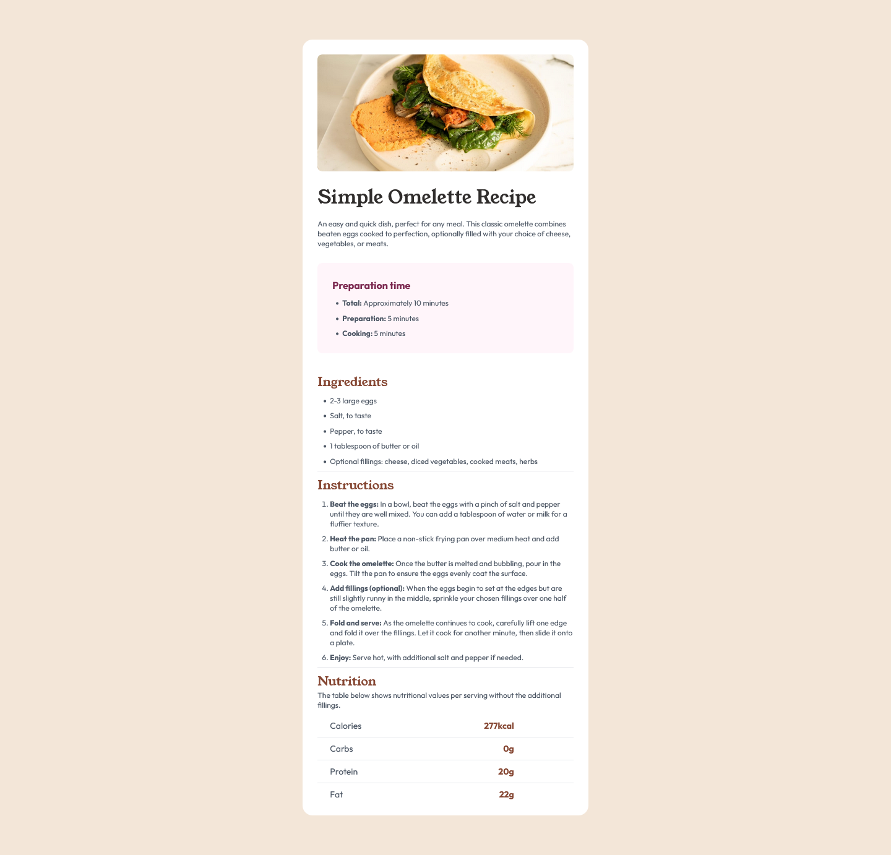

## Table of contents

- [Overview](#overview)
  - [The challenge](#the-challenge)
  - [Screenshot](#screenshot)
  - [Links](#links)
- [My process](#my-process)
  - [Built with](#built-with)
  - [What I learned](#what-i-learned)
  - [Continued development](#continued-development)
  - [Useful resources](#useful-resources)
- [Author](#author)
- [Acknowledgments](#acknowledgments)

## Overview

This is my 2nd project in FrontEnd Mentor using HTML & Tailwind.

### The challenge

This challenge will help you focus on writing semantic HTML. Ensure you think through what HTML elements are most appropriate for each piece of content.

### Links

- Solution URL: [Add solution URL here](https://www.frontendmentor.io/solutions/responsive-recipe-page-using-css-grid-and-flexbox-8BHL87qQb2)
- Live Site URL: [Add live site URL here](sleepypillowz-recipe-page.netlify.app/)

### Screenshot

## My process

  1. I created the skeleton html
  2. I added the contents of the page
  3. I referred to the style-guide.md
  4. I styled the contents of the page one by one
  4. I organized the code using @layer base and components

### Built with

- Semantic HTML5 markup
- CSS custom properties
- CSS Grid
- Mobile-first workflow
- [Tailwind](https://tailwindcss.com/) - CSS framework

### What I learned

- The process of creating a pseudo table using flex

- The application of @layer in tailwind to style specific html tags

### Continued development

There are certain bugs that I'd like to fix in the future
  - none for now, do message me if you spot a bug

### Useful resources

- [Tailwind](https://tailwindcss.com/) - This helped me refer to unfamiliar concepts and resources I may be able to use.

## Author

- Website - [alexacojido](https://alexacojido.netlify.app/)
- Frontend Mentor - [@sleepypillowz](https://www.frontendmentor.io/profile/sleepypillowz)
- Github - [sleepypillowz](https://github.com/sleepypillowz)

## Acknowledgments

Big thanks to The tailwind team for a good framework and documentation. Frontend mentor for providing a structured way of building websites.